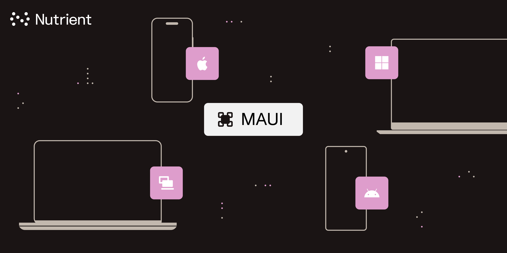

# PSPDFKit for MAUI - Catalog

This is a example Catalog app for [PSPDFKit for MAUI](http://pspdfkit.com//guides/maui/)

## What is PSPDFKit for MAUI?

PSPDFKit for MAUI is an SDK for viewing, annotating, and editing PDFs. It offers developers the ability to quickly add PDF functionality to any mobile or desktop application.

## Getting started with Catalog

For getting-started with our Catalog, [checkout our website](http://pspdfkit.com/getting-started/maui/?project=catalog-example)

## Using PSPDFKit for MAUI in your project

Starting a new project? No worries, we got you covered! Checkout our [getting-started guide for new project](http://pspdfkit.com//getting-started/maui/?project=new-project)

And if you already have an existing MAUI project you can refer to our [getting-started guide for existing project](http://pspdfkit.com/getting-started/maui/?project=existing-project)

## Changelog

To know about the latest changes in our PSPDFKit for MAUI SDK, checkout [our changelog](https://pspdfkit.com/changelog/maui/). 

## License

For buying a license, contact our [sales team](https://pspdfkit.com/sales) and if you already have one, to add the license to your MAUI project checkout our guide on ["Adding License Key"](https://pspdfkit.com/guides/maui/troubleshooting/license/adding-license-key).

## Support

Have queries? Contact our [support](https://pspdfkit.com/support/request/). We're here to support you every step of the way!
